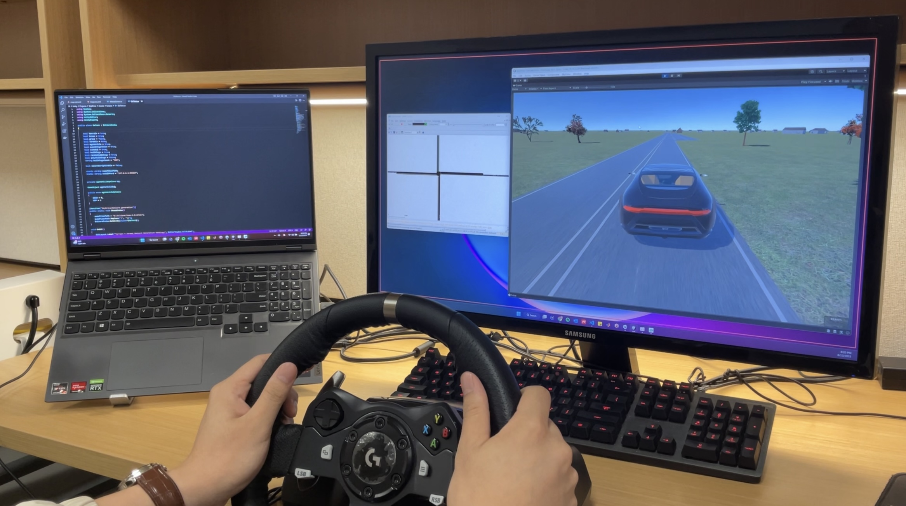

  
  
  
  
  
  
  

# SkyDrive (v1.0)

SkyDrive is a human-in-the-loop, digital-twin-enabled traffic simulator that seamlessly combines various cutting-edge technologies and tools to create a dynamic and realistic environment for experimenting with AI, self-driving cars, human-robot interaction, traffic flow optimization, and intelligent transportation systems. The simulator is designed to replicate real-world traffic scenarios while offering the flexibility to conduct controlled experiments and simulations for research and development purposes.

Current version: SkyDrive (v1.0). Some modules listed below are still under development/improvement.

## The main functions of SkyDrive are as follows
### Unity Integration
- Utilizes Unity's powerful graphics engine to create visually realistic virtual environments.
- Constructs immersive 3D environments, roads, and surroundings, fostering a genuine testbed for research and analysis.
- Enables the integration of VR/AR technology for a more interactive experience.

### SUMO Integration
- Integrates the Simulation of Urban MObility (SUMO) software for accurate traffic simulation and modeling.
- Simulates realistic vehicle behaviors, traffic flows, and road networks, contributing to a lifelike environment.
- Enables the customization of traffic scenarios, road layouts, and traffic signal configurations.

### Logitech Racing Wheel Integration
- Integrates Logitech racing wheel hardware for realistic vehicle control and interaction.
- Enables users to simulate vehicle maneuvers, including acceleration, braking, steering, and other driving actions.
- Provides a tangible and immersive experience for testing and evaluating control algorithms.

### VR/AR Integration
- Integrates Virtual Reality (VR) and Augmented Reality (AR) technologies for an immersive and interactive experience.
- Allows researchers and developers to experience the simulated environment firsthand, enhancing situational awareness.
- Supports the development of VR/AR-based human-machine interfaces and user interaction experiments.

### CAV Planning and Control
- Enables the testing and validation of CAV algorithms for path planning, trajectory optimization, and collision avoidance.
- Facilitates the evaluation of CAV control strategies in complex traffic scenarios.

### Human-Machine Interface (HMI) Experiments
- Supports the development and testing of intuitive and effective HMIs for both human drivers and autonomous systems.
- Allows for the assessment of user interactions, feedback mechanisms, and user experience in various driving scenarios.

### Reinforcement Learning and Deep Learning Experiments
- Provides a platform for training and evaluating RL and deep learning models for traffic control, decision-making, and optimization.
- Enables researchers to experiment with advanced AI techniques to improve traffic flow and efficiency.

## Demos

